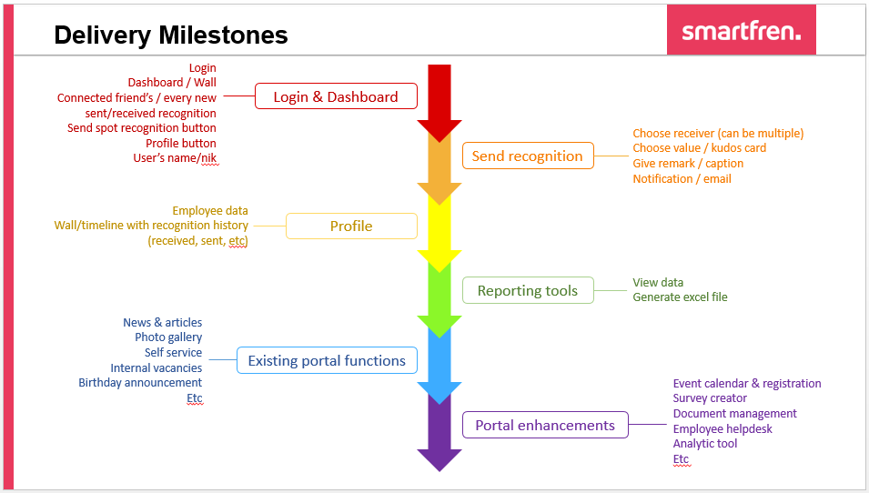

# ENGAGEMENT APP
> A centralized app for every employee to support his/her daily work life.
> First phase will focus on colleague recognition/kudos features.

::: warning Current state :
---
Working on UI/UX, user journey sent to Fares for review.
:::

## Related Documents
> Link for draft BRD (collab with business user to build the doc) : [Google Doc](https://docs.google.com/document/d/1uLUyEeKiCPGFswrEe09oHEgVIAYlJb5hW30Hh6SqJZw/edit#)  
> Link for draft user journey : [Google Slide](https://docs.google.com/presentation/d/19LxkGoz1xm09TAF4Bw9Fc19Xxj4keRJbxpplnL6-wjw/edit?usp=sharing)

## Milestones
|Date|Milestones|PIC|
|---|---|---|
|2020-02-04|Scenario finalized|Joseph Ruth Ayu|
|2020-01-23|Followup discussion for Engagement App features|Joseph Ayu Ruth Martino Jeffrey|
|2020-01-14|Brief discussion about spot recognition|Joseph Ayu Ruth|
|2020-01-09|Discussion about Engagement App|Joseph Sounak Fares Ayu Ruth|
|2020-01-06|List down functions and priorities|Joseph|
|2019-12-31|Initial meeting with business user|Nadia|

Draft BRD

## Overview and Background
> #### #1 Why do we need an employee portal?

As someone who grew up in this digitized age, there are two things that are important to our productivity :

- Ability to share and access informations and everything needed as easily and pain-free as possible
- Ability to connect with my teammates on more than just work

Our company portal / intranet needs to contain all of the information that keeps your company running. A successful intranet is one where users come back to stay on top of everything they need. The problem is, intranets aren’t often ingrained in a company’s processes or culture and forgotten. Either employees don’t know their intranet exists, don’t know how to use it, or don’t have any reason to.

In 2012, McKinsey & Company predicted that social intranet software could save companies 20-25% of white-collar labor costs. That calculation included:

- 7.0-8.0% less time spent on email.
- 5.5-6.5% less time spent searching and gathering information.
- 3.5-5.0% less time spent in staff meetings.
- 4.0-6.0% less time spent on role-specific tasks.

As these findings show, a social intranet will not eliminate all redundancy in the workplace. However, even small improvements in a few tasks performed by a majority of the workforce will add up to a staggering figure.
> #### #2 What’s the ROI?

- Increased productivity
- Increased employee engagement
- Reduced email traffic for admins
- Unified corporate communication
- Easier knowledge management and collaboration
- Increased internal vacancies fulfillment
- Faster onboarding process for new employee
- Increased training candidates
- Headcount reduction from automated functions
- Faster time to resolve employee issues
- Increased transparency between business units
- Reduced silo culture
> #### #3 What’s the objectives?

|Objectives|How?|
|----|----|
|Reduce IT burden|With content management system available, every changes can be done by HR or other admins without requesting to IT|
|Decrease staff turnover|Research shows that for every increase in staff satisfaction levels, there is also an increase in retention.    An intranet can increase satisfaction by improving engagement, keeping employees informed, communicating mission and purpose, and supporting a common culture|
|Enable staff to self-serve, reducing dependency on HR|Centralized storage of critical policies, forms, procedures, and company information on the intranet will allow staff to find information themselves, rather than going directly to HR.|
|Reduce time employees spend searching for information by|Research suggests workers spend on average 19% of their working week searching and gathering information.   An intranet, as part of an integrated and centralized digital workplace, provides a single, searchable version of truth, reducing time spent searching|

::: warning Assumptions
12,000 staff in organization (3000 permanent & contract, 9000 outsource)  
Average minumum salary (UMR) is on Rp3,000,000  
40 working hours a week (5 x 8hours)  
Salary per hour = Rp18,750,-  

**-- IF 1% of time is saved per month for each objectives**  
1% from 160 hours (month) = 1,6 hours  
Salary for 1,6 hours = Rp30,000  
For all employee (using average UMR) = 12,000 * Rp30,000 = Rp360,000,000 saving per month  
If every objectives can save 1%, then in total there will be 4 x Rp360,000,000 = Rp 1,440,000,000,- saved.  

**_1,44 bio rupiah can be saved monthly, with assumption every employee's salary is on average UMR, and only 1% of time is reduced for each objective_**

:::

## Dependencies
- Approval from IT security to open mobile app accessibility.

External sites :
- Application Portal
- BPM Application
- Medical Online
- Leave Online
- Performance Management

## Stakeholders
|Role|Description|Business Unit|Name|
|---|---|---|---|
|Domain Subject Matter Expert|_A domain subject matter expert is any individual with in-depth knowledge of a topic relevant to the business need or solution scope. This role is often filled by people who may be end users or people who have in-depth knowledge of the solution such as managers, process owners, legal staff, consultants, and others_|Employee Engagement|Nadia Suardin / Dyah Ayu Setyowati|
|Business Analyst|_The business analyst is inherently a stakeholder in all business analysis activities. The business analyst is responsible and accountable for the execution of these activities. In some cases the business analyst may also be responsible for performing activities that fall under another stakeholder role._|Sinarmas Digital|Joseph Christanto|
|Implementation Subject Matter Expert|An implementation subject matter expert is any stakeholder who has specialized knowledge regarding the implementation of one or more solution components.   While it is not possible to define a listing of implementation subject matter expert roles that are appropriate for all initiatives, some of the most common roles are: project librarian, change manager, configuration manager, solution architect, developer, database administrator, information architect, usability analyst, trainer, and organizational change consultant|Sinarmas Digital & IT|(tbc)|
|Tester|_Testers are responsible for determining how to verify that the solution meets the requirements defined by the business analyst, as well as conducting the verification process. Testers also seek to ensure that the solution meets applicable quality standards, and that the risk of defects or failures is understood and minimized. An alternate role is quality assurance analyst._|tbc||
|Operational Support|_Operational support is responsible for the day-to-day management and maintenance of a system or product. While it is not possible to define a listing of operational support roles that are appropriate for all initiatives, some of the most common roles are: operations analyst, product analyst, help desk, and release manager._|tbc||
|Project Manager|_Project managers are responsible for managing the work required to deliver a solution that meets a business need, and for ensuring that the project's objectives are met while balancing the project factors including scope, budget, schedule, resources, quality, and risk. While it is not possible to completely define a listing of project management roles that are appropriate for all initiatives, some of the most common roles are: project lead, technical lead, product manager, and team leader._|tbc||
|Regulator|_Regulators are responsible for the definition and enforcement of standards. Standards can be imposed on the solution by regulators through legislation, corporate governance standards, audit standards, or standards defined by organizational centers of competency. Alternate roles are government, regulatory bodies, and auditor_|-||
|Project Sponsor|_Sponsors are responsible for initiating the effort to define a business need and develop a solution that meets that need. They authorize the work to be performed, and control the budget and scope for the initiative. Alternate roles are executive and project sponsor._|Employee Engagement|Nadia Suardin / Dyah Ayu Setyowati|
|Supplier|_A supplier is a stakeholder outside the boundary of a given organization or organizational unit. Suppliers provide products or services to the organization and may have contractual or moral rights and obligations that must be considered. Alternate roles are providers, vendors, and consultants._|-||
|Executives|_The top management in the company executing the project, those who direct the organization's strategy_|-||
|End Users|_End users are stakeholders who directly interact with the solution. End users can include all participants in a business process, or who use the product or solution._|Smartfren Employee with LDAP Account|Smartfren Employee with LDAP Account|

## Business Requirement

## Key Assumption and Constraint

## Glossary of Terms

## Appendixes
### Appendix A - Website Structure
- As is Structure

### Appendix B - Proposed Delivery Flow

